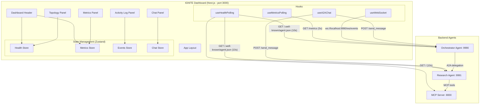
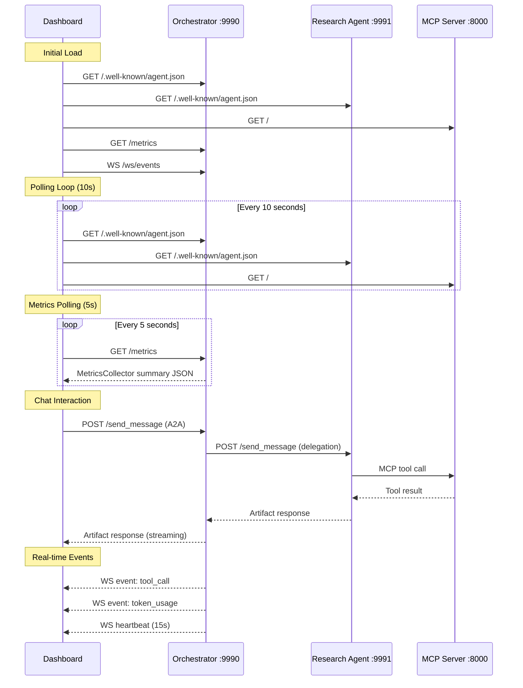

# Design Document: IGNITE Frontend Dashboard

## Overview

The IGNITE (Intelligent Service Orchestration) dashboard is a standalone Next.js frontend application that provides real-time monitoring, visualization, and interaction capabilities for an A2A + MCP + LangGraph multi-agent system. It connects to backend Python agents via HTTP REST endpoints and WebSocket connections, presenting a professional dark-themed 2x2 panel layout with agent topology visualization, server metrics/telemetry, agent chat, and activity logging.

The dashboard is architecturally independent from the backend — it communicates exclusively through well-defined HTTP and WebSocket APIs, enabling independent development, deployment, and versioning. The backend requires minimal extensions: a `/metrics` GET endpoint exposing the existing `MetricsCollector` summary and a `/ws/events` WebSocket endpoint for real-time event streaming.

### Key Design Decisions

1. **Next.js App Router** — Leverages React Server Components for initial page load performance while using client components for real-time interactive panels.
2. **React Flow for topology** — Provides a mature, performant directed graph library with built-in layout algorithms, avoiding custom SVG/Canvas rendering.
3. **Recharts for time-series** — Lightweight charting library well-suited for real-time updating line charts and gauge-style visualizations.
4. **Native WebSocket + custom hook** — Avoids heavy socket libraries; a custom `useWebSocket` hook handles reconnection logic with exponential backoff.
5. **Zustand for state management** — Lightweight, TypeScript-friendly store that avoids Redux boilerplate while supporting multiple independent slices (metrics, events, chat, health).
6. **Tailwind CSS dark theme** — Single dark theme with CSS custom properties for the specified color palette, no theme switching needed.

## Architecture



### Data Flow



## Components and Interfaces

### Project Structure

```
ignite-dashboard/
├── src/
│   ├── app/
│   │   ├── layout.tsx          # Root layout with dark theme, fonts
│   │   ├── page.tsx            # Main dashboard page (2x2 grid)
│   │   └── globals.css         # Tailwind directives + CSS variables
│   ├── components/
│   │   ├── Header.tsx          # Dashboard header with global status
│   │   ├── TopologyPanel.tsx   # Agent graph visualization
│   │   ├── MetricsPanel.tsx    # Gauges + time-series charts
│   │   ├── ChatPanel.tsx       # Tabbed A2A chat interface
│   │   ├── ActivityLogPanel.tsx # Real-time event table
│   │   ├── ui/                 # Shared UI primitives
│   │   │   ├── Gauge.tsx       # Circular gauge component
│   │   │   ├── StatusBadge.tsx # Status indicator (ONLINE/OFFLINE/DEGRADED)
│   │   │   └── Panel.tsx       # Card wrapper with dark theme styling
│   │   └── topology/
│   │       ├── AgentNode.tsx   # Custom React Flow node
│   │       └── edges.ts        # Edge configuration
│   ├── hooks/
│   │   ├── useHealthPolling.ts # Agent health check polling (10s)
│   │   ├── useMetricsPolling.ts# Metrics endpoint polling (5s)
│   │   ├── useWebSocket.ts     # WebSocket with auto-reconnect
│   │   └── useA2AChat.ts       # A2A message send/receive
│   ├── stores/
│   │   ├── healthStore.ts      # Agent online/offline state
│   │   ├── metricsStore.ts     # Time-series metrics buffer
│   │   ├── eventsStore.ts      # Activity log event buffer
│   │   └── chatStore.ts        # Per-agent message histories
│   ├── lib/
│   │   ├── config.ts           # Environment variable resolution
│   │   ├── api.ts              # HTTP client utilities
│   │   ├── types.ts            # Shared TypeScript interfaces
│   │   └── utils.ts            # Formatting, time helpers
│   └── __tests__/              # Test files
│       ├── config.test.ts
│       ├── stores.test.ts
│       ├── utils.test.ts
│       └── properties/         # Property-based tests
│           ├── config.property.test.ts
│           ├── healthStatus.property.test.ts
│           ├── metricsBuffer.property.test.ts
│           ├── chatValidation.property.test.ts
│           ├── eventsFilter.property.test.ts
│           └── globalStatus.property.test.ts
├── public/
├── tailwind.config.ts
├── tsconfig.json
├── next.config.ts
├── package.json
├── .env.local.example
└── README.md
```

### Key Interfaces

```typescript
// lib/types.ts

// Agent configuration
interface AgentConfig {
  id: string;
  name: string;
  url: string;
  port: number;
  type: 'orchestrator' | 'worker' | 'mcp';
  healthEndpoint: string; // /.well-known/agent.json or /
}

// Health status
type AgentStatus = 'online' | 'offline' | 'checking';
type GlobalStatus = 'online' | 'degraded' | 'offline' | 'checking';

interface AgentHealthState {
  agentId: string;
  status: AgentStatus;
  lastChecked: number; // timestamp
  agentCard?: AgentCard | null;
}

// Metrics
interface MetricsSnapshot {
  timestamp: string; // ISO 8601
  model: string | null;
  requests_total: number;
  errors_total: number;
  inter_agent_messages: number;
  tool_calls: number;
  retrievals: number;
  tokens_total: number;
  tokens_prompt: number;
  tokens_completion: number;
  submission_latencies: number[];
  task_durations: number[];
  tools_used: string[];
  ai_messages_count: number;
  reasoning_steps: number;
  avg_latency: number;
  avg_task_duration: number;
  tokens_per_request: number;
  tools_per_request: number;
}

interface TimeSeriesPoint {
  timestamp: number;
  tokensPerSecond: number;
  avgLatency: number;
  p50Latency: number;
  p95Latency: number;
  p99Latency: number;
}

// WebSocket Events
interface AgentEvent {
  timestamp: string; // ISO 8601
  agent: string;
  event_type: 'request' | 'tool_call' | 'token_usage' | 'inter_agent_message' | 'error' | 'heartbeat';
  details: Record<string, unknown>;
}

// Chat
interface ChatMessage {
  id: string;
  role: 'user' | 'agent';
  content: string;
  agentName?: string;
  timestamp: number;
  status: 'sent' | 'pending' | 'error';
  error?: string;
}

// A2A Protocol (subset used by dashboard)
interface A2AMessage {
  role: 'user';
  messageId: string;
  parts: Array<{ root: { text: string } }>;
}
```

### Store Interfaces

```typescript
// stores/healthStore.ts
interface HealthStore {
  agents: Record<string, AgentHealthState>;
  globalStatus: GlobalStatus;
  activeCount: number;
  totalCount: number;
  setAgentStatus: (agentId: string, status: AgentStatus, card?: AgentCard) => void;
  getGlobalStatus: () => GlobalStatus;
}

// stores/metricsStore.ts
interface MetricsStore {
  current: MetricsSnapshot | null;
  timeSeries: TimeSeriesPoint[]; // max 60 items
  isAvailable: boolean;
  modelName: string;
  addSnapshot: (snapshot: MetricsSnapshot) => void;
  setUnavailable: () => void;
  setAvailable: () => void;
}

// stores/eventsStore.ts
interface EventsStore {
  events: AgentEvent[]; // max 500 items, newest first
  filter: string; // event type or 'all'
  isConnected: boolean;
  addEvent: (event: AgentEvent) => void;
  setFilter: (filter: string) => void;
  setConnected: (connected: boolean) => void;
  getFilteredEvents: () => AgentEvent[];
}

// stores/chatStore.ts
interface ChatStore {
  histories: Record<string, ChatMessage[]>; // per-agent, max 200 each
  activeAgent: string;
  isPending: boolean;
  addMessage: (agentId: string, message: ChatMessage) => void;
  setActiveAgent: (agentId: string) => void;
  setPending: (pending: boolean) => void;
}
```

### Hook Interfaces

```typescript
// hooks/useHealthPolling.ts
function useHealthPolling(agents: AgentConfig[], intervalMs?: number): void;
// Polls agent health endpoints every intervalMs (default 10000)
// Updates healthStore on each response

// hooks/useMetricsPolling.ts
function useMetricsPolling(url: string, intervalMs?: number): void;
// Polls /metrics every intervalMs (default 5000)
// Updates metricsStore with new snapshots

// hooks/useWebSocket.ts
interface UseWebSocketOptions {
  url: string;
  onMessage: (event: AgentEvent) => void;
  onConnect?: () => void;
  onDisconnect?: () => void;
  reconnectInterval?: number; // default 5000ms
}
function useWebSocket(options: UseWebSocketOptions): { isConnected: boolean };

// hooks/useA2AChat.ts
function useA2AChat(agentUrl: string): {
  sendMessage: (text: string) => Promise<void>;
  isPending: boolean;
};
```

## Data Models

### Environment Configuration

| Variable | Purpose | Default |
|----------|---------|---------|
| `NEXT_PUBLIC_ORCHESTRATOR_URL` | Orchestrator agent base URL | `http://localhost:9990` |
| `NEXT_PUBLIC_RESEARCH_AGENT_URL` | Research agent base URL | `http://localhost:9991` |
| `NEXT_PUBLIC_MCP_SERVER_URL` | MCP server base URL | `http://localhost:8000` |

### Agent Topology Graph Model

```typescript
// Static topology definition derived from agent configuration
const TOPOLOGY_EDGES = [
  { source: 'orchestrator', target: 'research-agent', label: 'A2A' },
  { source: 'research-agent', target: 'mcp-server', label: 'MCP' },
];

const AGENT_NODES: AgentConfig[] = [
  { id: 'orchestrator', name: 'Orchestrator Agent', url: ENV.ORCHESTRATOR_URL, port: 9990, type: 'orchestrator', healthEndpoint: '/.well-known/agent.json' },
  { id: 'research-agent', name: 'Research Agent', url: ENV.RESEARCH_AGENT_URL, port: 9991, type: 'worker', healthEndpoint: '/.well-known/agent.json' },
  { id: 'mcp-server', name: 'MCP Server', url: ENV.MCP_SERVER_URL, port: 8000, type: 'mcp', healthEndpoint: '/' },
];
```

### Metrics Time-Series Buffer

The metrics store maintains a circular buffer of 60 `TimeSeriesPoint` entries (5 minutes at 5-second intervals). Each new poll computes derived values by comparing the current snapshot to the previous one:

- **tokensPerSecond** = `(current.tokens_total - previous.tokens_total) / pollIntervalSeconds`
- **avgLatency** = `current.avg_latency`
- **p50/p95/p99** = computed from `current.submission_latencies` array using sorted index selection

### Chat Message Buffer

Each agent tab maintains an independent array of up to 200 `ChatMessage` entries. When the limit is exceeded, the oldest message (index 0) is removed before appending the new message.

### Activity Event Buffer

A single array of up to 500 `AgentEvent` entries, ordered newest-first (prepend). When the limit is exceeded, the oldest event (last element) is removed.

### Backend API Extensions

#### GET /metrics (Orchestrator :9990)

Returns the existing `MetricsCollector.summary()` output with an added `timestamp` field:

```json
{
  "timestamp": "2024-01-15T10:30:00.000Z",
  "model": "qwen3:4b",
  "requests_total": 42,
  "errors_total": 1,
  "inter_agent_messages": 15,
  "tool_calls": 8,
  "tokens_total": 12500,
  "tokens_prompt": 8000,
  "tokens_completion": 4500,
  "submission_latencies": [0.5, 0.8, 1.2],
  "task_durations": [2.1, 3.5],
  "tools_used": ["duckduckgo_search", "wikipedia_search"],
  "ai_messages_count": 20,
  "reasoning_steps": 18,
  "avg_latency": 0.83,
  "avg_task_duration": 2.8,
  "tokens_per_request": 297.6,
  "tools_per_request": 0.19
}
```

#### WS /ws/events (Orchestrator :9990)

Streams JSON messages:

```json
{
  "timestamp": "2024-01-15T10:30:05.123Z",
  "agent": "Orchestrator Agent",
  "event_type": "tool_call",
  "details": { "tool_name": "duckduckgo_search", "query": "LangGraph agents" }
}
```

Heartbeat every 15 seconds:
```json
{
  "event_type": "heartbeat",
  "timestamp": "2024-01-15T10:30:15.000Z"
}
```

## Correctness Properties

*A property is a characteristic or behavior that should hold true across all valid executions of a system — essentially, a formal statement about what the system should do. Properties serve as the bridge between human-readable specifications and machine-verifiable correctness guarantees.*

### Property 1: Environment Variable Resolution

*For any* combination of set and unset environment variables (NEXT_PUBLIC_ORCHESTRATOR_URL, NEXT_PUBLIC_RESEARCH_AGENT_URL, NEXT_PUBLIC_MCP_SERVER_URL), the configuration resolver SHALL return the environment value when set, or the correct default value (http://localhost:9990, http://localhost:9991, http://localhost:8000 respectively) when unset.

**Validates: Requirements 1.2**

### Property 2: Agent Health Status Derivation

*For any* agent and any health check outcome (HTTP 200 with valid JSON within 5 seconds → "online", non-200 or timeout → "offline"), the status derivation function SHALL map the outcome to the correct AgentStatus value.

**Validates: Requirements 2.3, 2.4, 2.9**

### Property 3: Agent Node Label Rendering

*For any* agent configuration containing a name and port number, the rendered node label SHALL contain both the agent name string and the port number.

**Validates: Requirements 2.6**

### Property 4: Gauge Auto-Scaling

*For any* valid metrics snapshot with non-negative numeric values for requests, tokens, tool calls, and active agents, each gauge's maximum SHALL equal 120% of the highest observed value for that metric, and the displayed value SHALL equal the current metric value.

**Validates: Requirements 3.1**

### Property 5: Derived Metrics Computation

*For any* two consecutive valid metrics snapshots separated by a known time interval, the computed tokens-per-second SHALL equal the token difference divided by the interval, and the P50/P95/P99 latency percentiles SHALL equal the values at the 50th/95th/99th sorted indices of the submission_latencies array.

**Validates: Requirements 3.2**

### Property 6: Metrics Time-Series Buffer Invariant

*For any* sequence of metrics snapshots added to the time-series buffer, the buffer length SHALL never exceed 60, and when the 61st item is added, the oldest item SHALL be removed first.

**Validates: Requirements 3.6**

### Property 7: Chat Message Validation

*For any* string input, the chat validation function SHALL accept the message if and only if the trimmed string has length between 1 and 10,000 characters (inclusive). Strings that are empty or consist entirely of whitespace SHALL be rejected.

**Validates: Requirements 4.2, 4.9**

### Property 8: Chat Response Attribution

*For any* agent response message, the rendered chat bubble SHALL contain the agent's name in its attribution area.

**Validates: Requirements 4.3**

### Property 9: Chat History Buffer Invariant

*For any* sequence of messages added to a single agent's chat history, the history length SHALL never exceed 200, and when the 201st message is added, the oldest message SHALL be removed first.

**Validates: Requirements 4.7**

### Property 10: Event Table Row Rendering

*For any* valid AgentEvent with timestamp, agent, event_type, and details fields, the rendered table row SHALL contain the formatted timestamp (HH:mm:ss.SSS), the agent name, and the event type label.

**Validates: Requirements 5.1**

### Property 11: Event Type Categorization

*For any* event with an event_type field, the categorization function SHALL map known types ("request", "tool_call", "token_usage", "inter_agent_message", "error") to their display labels, and SHALL map any unrecognized type to "Unknown".

**Validates: Requirements 5.2**

### Property 12: Event Filtering

*For any* set of retained events and any selected filter type, the filtered result SHALL contain exactly those events whose event_type matches the filter, or all events when the filter is "all".

**Validates: Requirements 5.3, 5.4**

### Property 13: Activity Log Buffer Invariant

*For any* sequence of events added to the activity log, the buffer length SHALL never exceed 500, and when the 501st event is added, the oldest event SHALL be removed first.

**Validates: Requirements 5.5**

### Property 14: Event Ordering

*For any* sequence of events added to the activity log, events SHALL be stored in reverse chronological order (newest first), meaning each newly added event appears at index 0.

**Validates: Requirements 5.6**

### Property 15: Event Detail Extraction

*For any* event of type "token_usage", the details display SHALL include prompt tokens, completion tokens, and total tokens. *For any* event of type "tool_call", the details display SHALL include the tool name. *For any* event of type "inter_agent_message", the details display SHALL include the target agent name. *For any* event of type "error", the details display SHALL include the error summary text.

**Validates: Requirements 5.9**

### Property 16: Active Agent Count

*For any* set of agent health states, the displayed active count SHALL equal the number of agents with status "online", and the total count SHALL equal the total number of configured agents.

**Validates: Requirements 6.3**

### Property 17: Global Status Badge Derivation

*For any* array of agent statuses where all agents have been checked (no "checking" states), the global status SHALL be "online" when all are online, "degraded" when at least one but not all are offline, and "offline" when all are offline.

**Validates: Requirements 6.5, 6.6, 6.7**

### Property 18: Metrics API Response Schema

*For any* valid MetricsCollector state, the /metrics endpoint response SHALL contain all fields from the summary() output plus a valid ISO 8601 "timestamp" field.

**Validates: Requirements 7.6**

## Error Handling

### Network Failures

| Scenario | Behavior |
|----------|----------|
| Agent health check fails (timeout/error) | Mark agent as "offline", continue polling |
| Metrics endpoint unreachable | Show "Metrics Unavailable" indicator, retain last data |
| WebSocket disconnects | Show "Disconnected" indicator, reconnect every 5s |
| Chat message send fails/times out (120s) | Show error in chat history, re-enable input |
| CORS error on metrics | Log to console, show "Metrics Unavailable" |

### Input Validation

| Input | Validation | Error Behavior |
|-------|-----------|----------------|
| Chat message | 1-10,000 chars, not whitespace-only | Silently reject, keep focus on input |
| Environment variables | Valid URL format | Use default, log warning |

### Backend Error Responses

| Endpoint | Error Response | Dashboard Handling |
|----------|---------------|-------------------|
| GET /metrics | 503 Service Unavailable | Treat as unreachable, show indicator |
| POST /send_message | 4xx/5xx | Display error in chat history |
| WS /ws/events | Connection refused | Show "Disconnected", retry |

### Graceful Degradation

The dashboard operates in a degraded mode when backend services are unavailable:
- Topology panel shows nodes with "OFFLINE" status but maintains graph structure
- Metrics panel retains last known data with "Metrics Unavailable" overlay
- Chat panel shows error messages but remains interactive for retry
- Activity log shows "Disconnected" but retains existing events

## Testing Strategy

### Property-Based Testing (fast-check)

The project uses **fast-check** as the property-based testing library with **Vitest** as the test runner.

**Configuration:**
- Minimum 100 iterations per property test
- Each test tagged with: `Feature: ignite-frontend-dashboard, Property {N}: {description}`
- Tests target pure functions and state derivation logic

**Property tests cover:**
- Configuration resolution (Property 1)
- Status derivation logic (Properties 2, 17)
- Buffer invariants (Properties 6, 9, 13)
- Input validation (Property 7)
- Data computation (Properties 4, 5)
- Filtering and categorization (Properties 11, 12)
- Rendering data extraction (Properties 3, 8, 10, 14, 15, 16)
- API schema validation (Property 18)

### Unit Tests (Vitest)

Example-based tests for:
- Component rendering (topology graph structure, header content)
- Initial states (CHECKING badge, empty panels)
- Error state transitions (unavailable → available)
- Static content verification (title, subtitle, color values)
- CSS class assertions (responsive breakpoints, font families)

### Integration Tests

- WebSocket connection lifecycle (connect, receive events, disconnect, reconnect)
- A2A message round-trip with mocked backend
- Polling interval verification with fake timers
- Responsive layout breakpoint behavior

### Test Commands

```bash
# Run all tests
npm run test

# Run property-based tests only
npm run test -- --grep "Property"

# Run with coverage
npm run test:coverage
```

### Dependencies

```json
{
  "devDependencies": {
    "vitest": "2.1.8",
    "fast-check": "3.23.2",
    "@testing-library/react": "16.1.0",
    "@testing-library/jest-dom": "6.6.3",
    "jsdom": "25.0.1",
    "msw": "2.7.0"
  }
}
```
