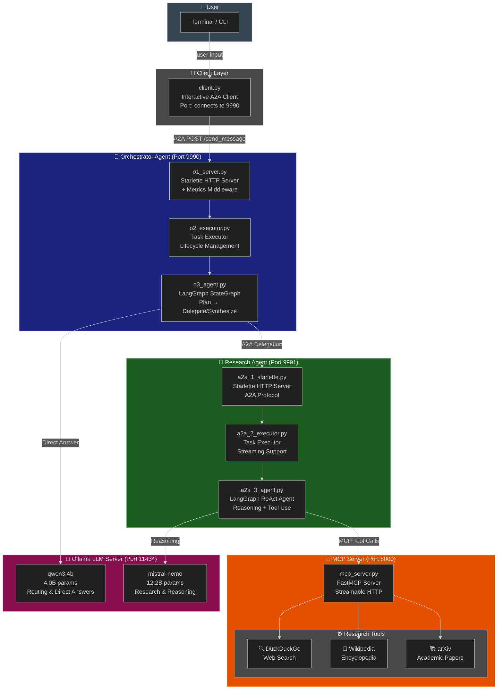
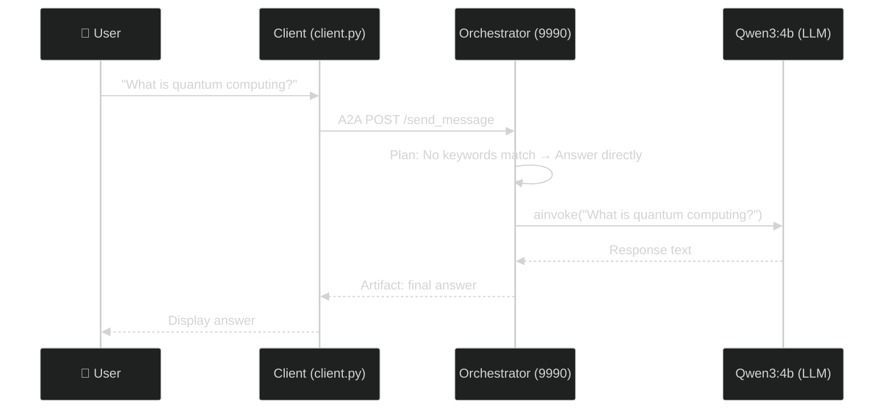
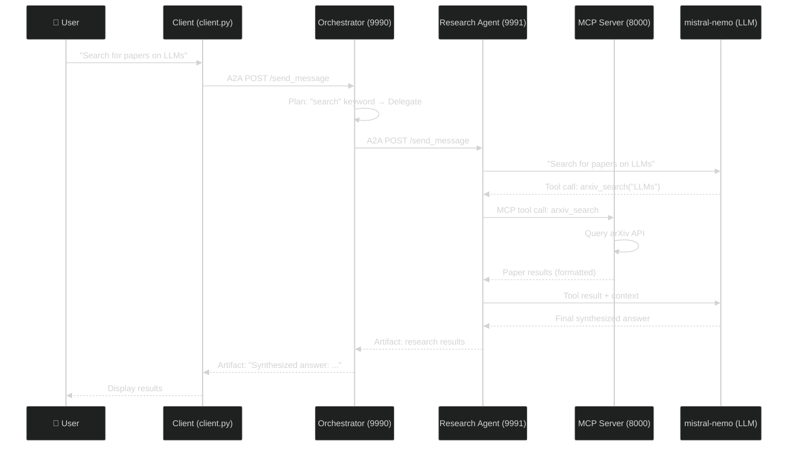
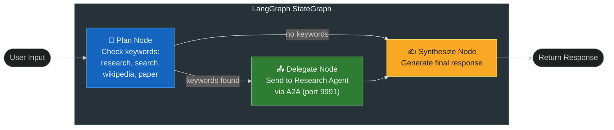
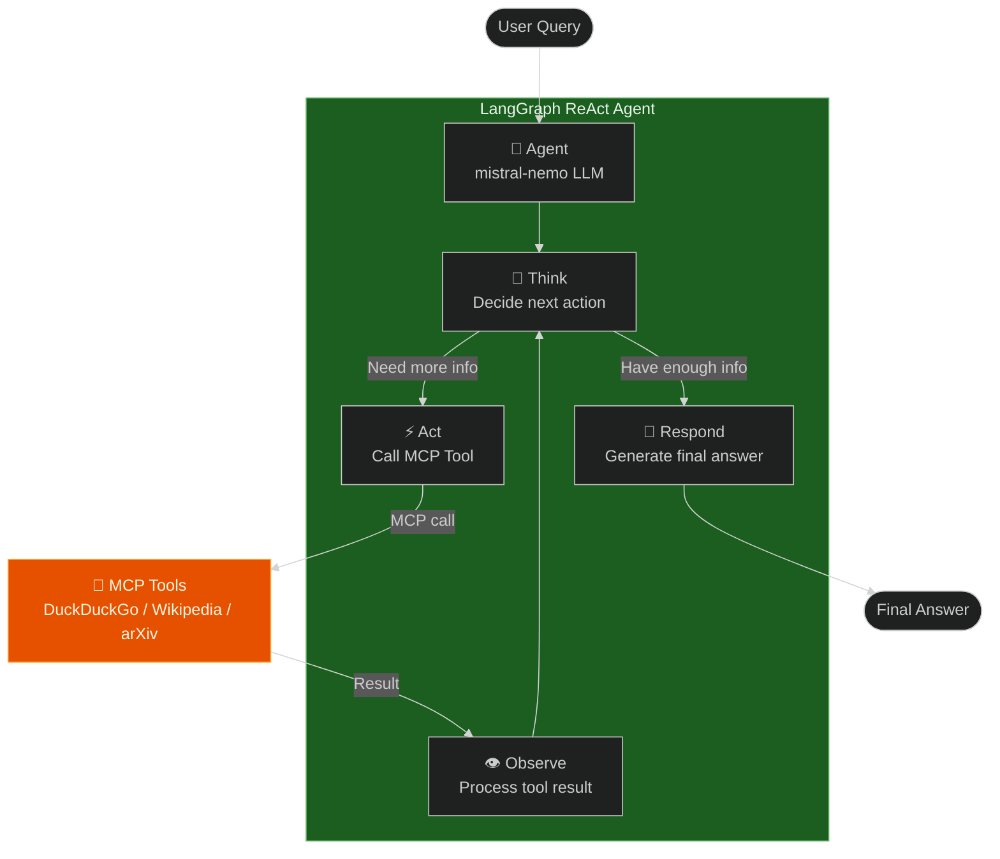
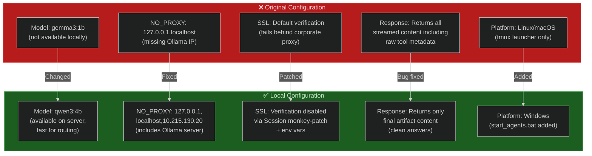
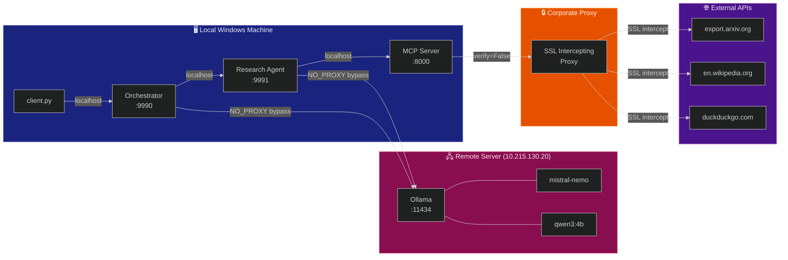
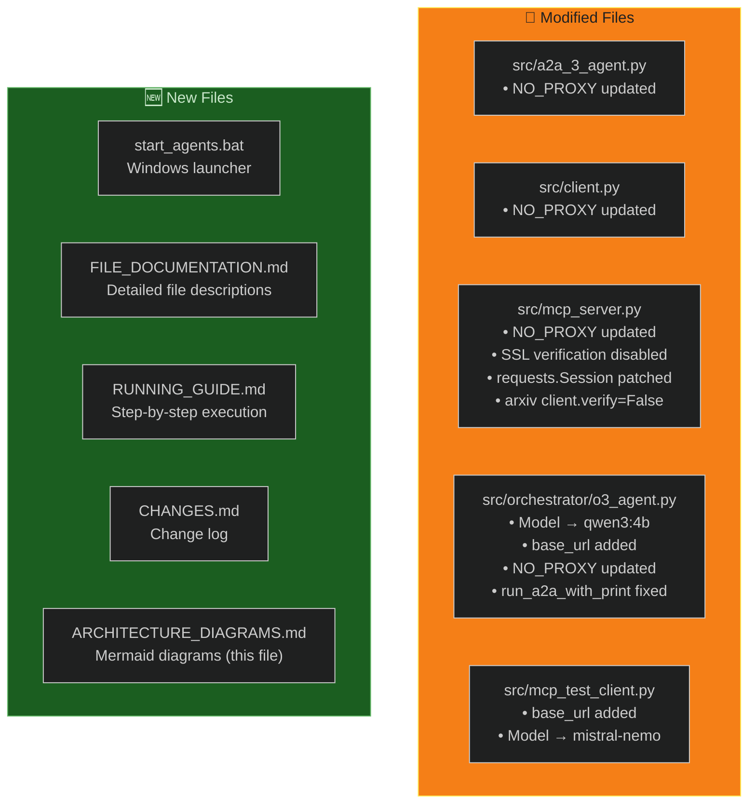
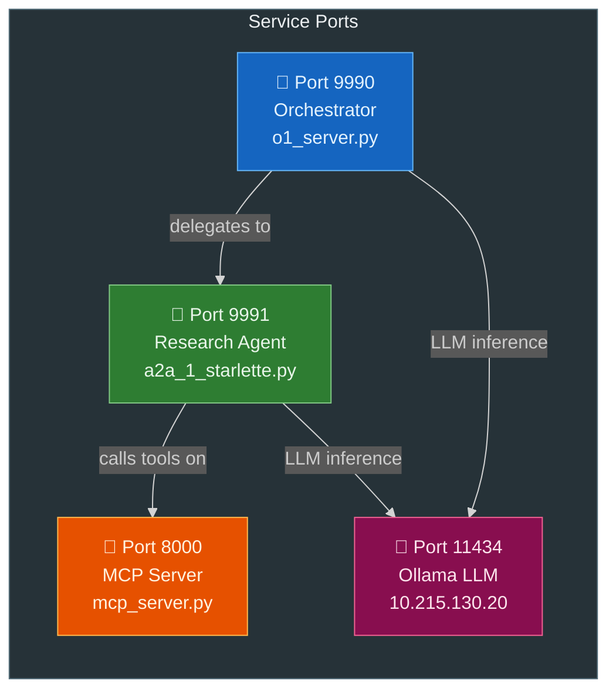

# Architecture Diagrams

## 1. Project Architecture Overview

---

## 2. Request Flow — Direct Answer

---

## 3. Request Flow — Delegated Research

---

## 4. Orchestrator Decision Graph

---

## 5. Research Agent ReAct Loop

---

## 6. Changes Made for Local Execution

---

## 7. Network Topology — Local Setup

---

## 8. File Change Map

---

## Port Reference

