# IGNITE — Full Project Documentation

## Multi-Agent Orchestration Platform with Real-Time Dashboard

This document provides a comprehensive explanation of the entire repository, covering both the **Python backend** (multi-agent system) and the **Next.js frontend** (IGNITE monitoring dashboard).

---

## Table of Contents

1. [System Overview](#1-system-overview)
2. [Architecture Diagrams](#2-architecture-diagrams)
3. [Backend — Python Multi-Agent System](#3-backend--python-multi-agent-system)
4. [Frontend — IGNITE Dashboard](#4-frontend--ignite-dashboard)
5. [Communication Protocols](#5-communication-protocols)
6. [Data Flow Diagrams](#6-data-flow-diagrams)
7. [Running the System](#7-running-the-system)
8. [File Reference](#8-file-reference)

---

## 1. System Overview

This project implements a **fully local agentic AI platform** with:

- **Multi-agent orchestration** using LangGraph state machines
- **Tool access** via Model Context Protocol (MCP)
- **Agent-to-Agent communication** via A2A protocol
- **Local LLM inference** via Ollama (mistral-nemo, mistral)
- **Real-time monitoring dashboard** built with Next.js, React Flow, and Recharts


---

## 2. Architecture Diagrams

### 2.1 Full System Architecture

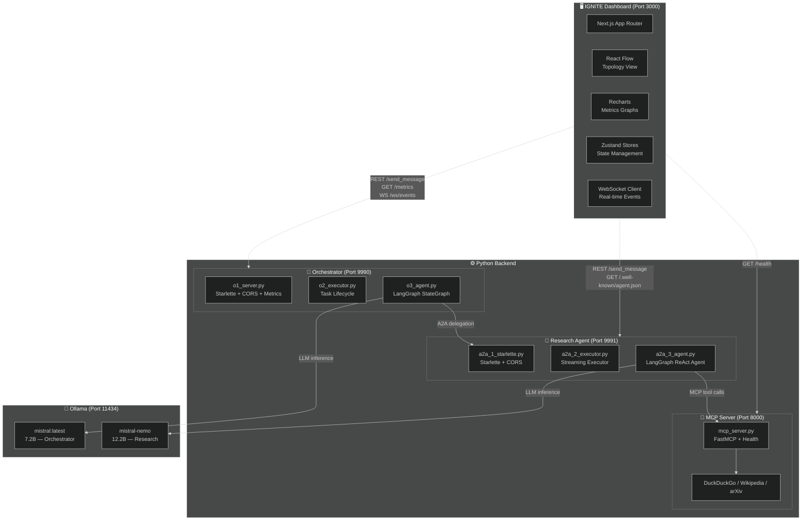

### 2.2 Request Routing Flow

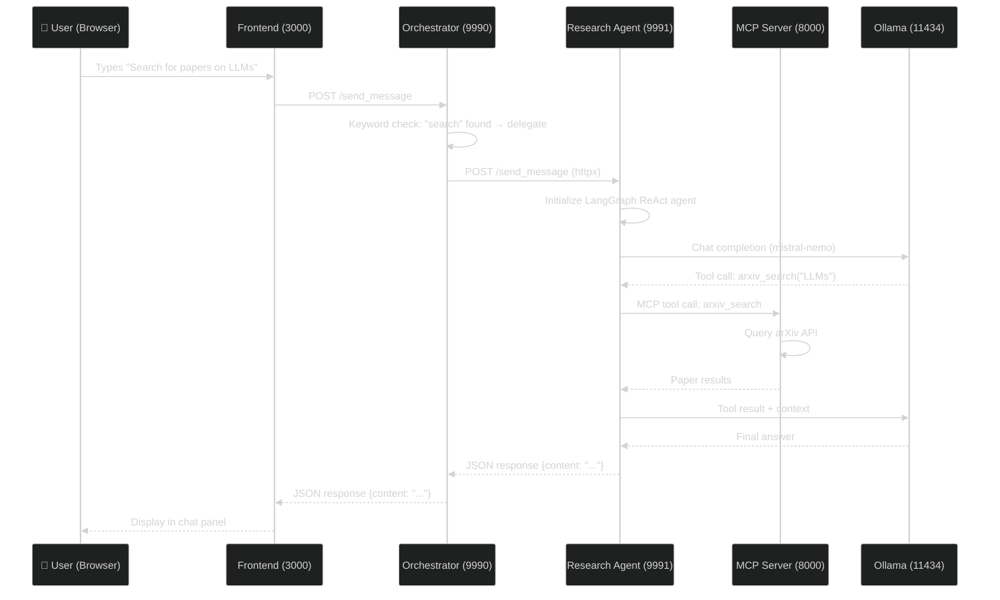

### 2.3 Frontend Component Architecture

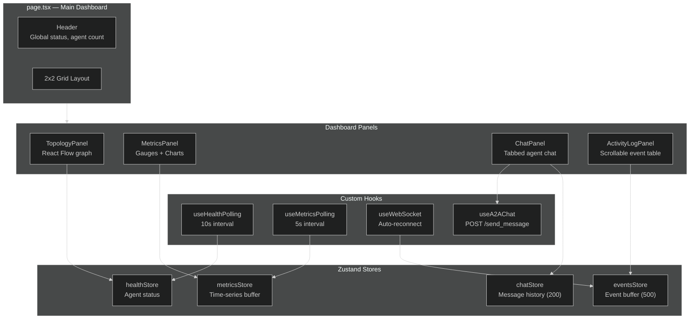

---

## 3. Backend — Python Multi-Agent System

### 3.1 MCP Server (`src/mcp_server.py`)

**Port:** 8000 | **Framework:** FastMCP + Starlette wrapper

The MCP server exposes research tools via the Model Context Protocol. Agents connect to it to discover and call tools.

**Endpoints:**
| Endpoint | Method | Purpose |
|----------|--------|---------|
| `/health` | GET | Health check (returns JSON with status + tool list) |
| `/mcp/` | POST | MCP protocol endpoint (tool discovery + execution) |

**Tools exposed:**
| Tool | API | Description |
|------|-----|-------------|
| `duckduckgo_search` | DuckDuckGo | Web search, returns top 5 results |
| `wikipedia_search` | Wikipedia | 3-sentence encyclopedia summary |
| `arxiv_search` | arXiv | Academic papers sorted by date |

**Key implementation details:**
- All tools run blocking I/O in thread pools via `run_in_executor`
- SSL verification disabled globally (corporate proxy workaround)
- `requests.Session` monkey-patched to set `verify=False`
- Graceful shutdown via signal handlers

### 3.2 Research Agent (`src/a2a_1_starlette.py` + `a2a_2_executor.py` + `a2a_3_agent.py`)

**Port:** 9991 | **LLM:** mistral-nemo (12.2B) | **Pattern:** ReAct Agent

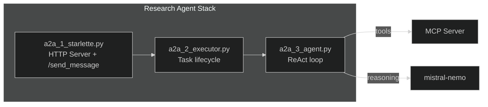

**How the ReAct loop works:**
1. LLM receives the user query + system prompt
2. LLM decides: answer directly OR call a tool
3. If tool call → execute via MCP → feed result back to LLM
4. Repeat until LLM produces a final answer with `status: completed`

**Key classes:**
- `langG_agent` — Core agent with `stream()` and `invoke()` methods
- `LangGraphAgentExecutor` — A2A-compatible task executor
- `ResponseFormat` — Pydantic model enforcing structured output


### 3.3 Orchestrator Agent (`src/orchestrator/o1_server.py` + `o2_executor.py` + `o3_agent.py`)

**Port:** 9990 | **LLM:** mistral:latest (7.2B) | **Pattern:** Custom StateGraph

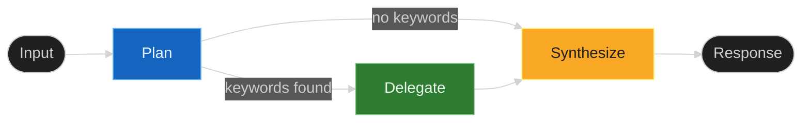

**Routing logic (Plan node):**
```python
needs_delegation = any(
    k in user_input.lower()
    for k in ["research", "search", "wikipedia", "paper"]
)
```

**Endpoints:**
| Endpoint | Method | Purpose |
|----------|--------|---------|
| `/send_message` | POST | REST chat endpoint (used by dashboard) |
| `/metrics` | GET | Returns MetricsCollector summary as JSON |
| `/ws/events` | WS | Real-time event stream with 15s heartbeat |
| `/.well-known/agent.json` | GET | A2A agent card (capabilities) |

**Metrics collected:**
- Request count, error count, latencies
- Token usage (prompt, completion, total)
- Tool calls, inter-agent messages
- Task durations, model name

### 3.4 Metrics System (`src/orchestrator/metrics.py` + `metrics_middleware.py`)

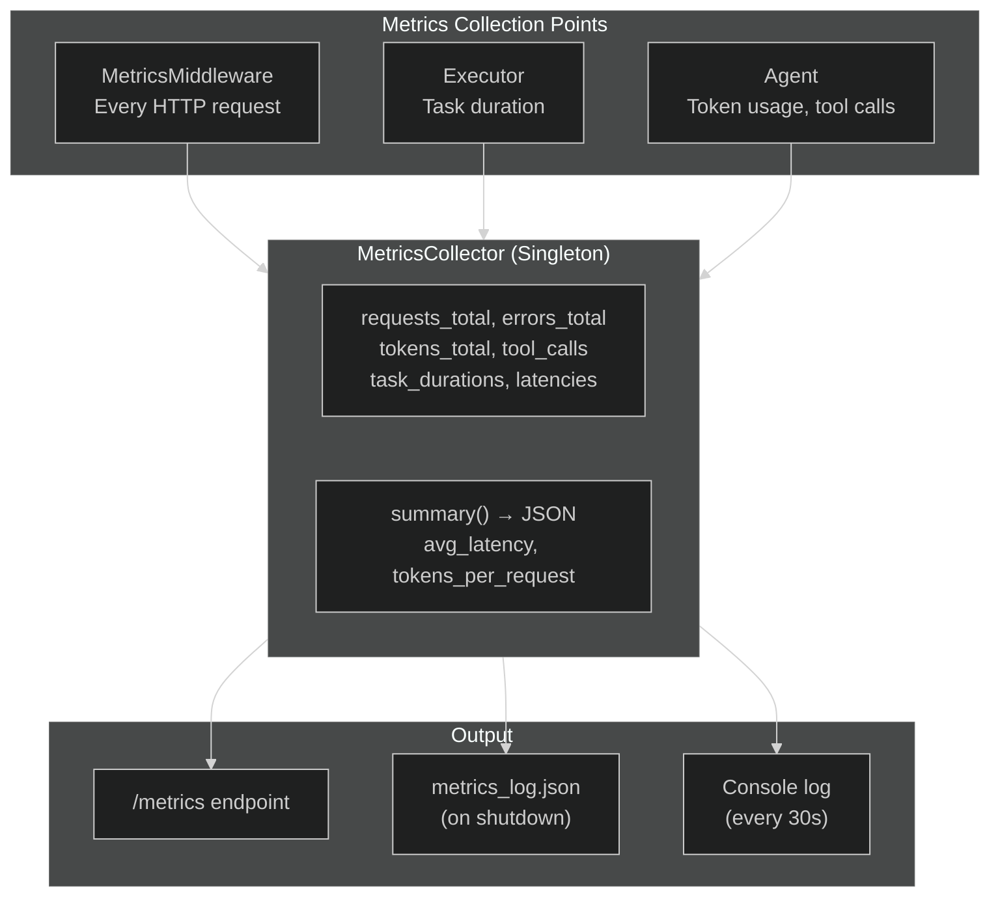


---

## 4. Frontend — IGNITE Dashboard

### 4.1 Technology Stack

| Technology | Purpose |
|------------|---------|
| Next.js 15.1 | React framework with App Router |
| TypeScript | Type safety |
| Tailwind CSS | Dark theme styling |
| React Flow (@xyflow/react) | Agent topology graph |
| Recharts | Time-series charts and gauges |
| Zustand | Lightweight state management |
| Vitest + fast-check | Testing (unit + property-based) |

### 4.2 Directory Structure

```
ignite-dashboard/
├── src/
│   ├── app/                    # Next.js App Router
│   │   ├── layout.tsx          # Root layout (dark theme, fonts)
│   │   ├── page.tsx            # Main dashboard page (2x2 grid)
│   │   └── globals.css         # Tailwind + CSS custom properties
│   ├── components/             # React components
│   │   ├── Header.tsx          # Global status bar
│   │   ├── TopologyPanel.tsx   # Agent graph (React Flow)
│   │   ├── MetricsPanel.tsx    # Gauges + line charts
│   │   ├── ChatPanel.tsx       # Tabbed agent chat
│   │   ├── ActivityLogPanel.tsx# Scrollable event table
│   │   ├── topology/           # Custom React Flow nodes/edges
│   │   └── ui/                 # Shared UI primitives
│   ├── hooks/                  # Custom React hooks
│   │   ├── useHealthPolling.ts # Agent health checks (10s)
│   │   ├── useMetricsPolling.ts# Metrics fetching (5s)
│   │   ├── useWebSocket.ts     # WS with auto-reconnect
│   │   └── useA2AChat.ts       # Chat message sending
│   ├── stores/                 # Zustand state stores
│   │   ├── healthStore.ts      # Agent online/offline status
│   │   ├── metricsStore.ts     # Time-series buffer (60 points)
│   │   ├── eventsStore.ts      # Event buffer (500 events)
│   │   └── chatStore.ts        # Chat history (200 per agent)
│   ├── lib/                    # Shared utilities
│   │   ├── types.ts            # TypeScript interfaces
│   │   ├── config.ts           # Environment + agent config
│   │   ├── api.ts              # HTTP client with timeout
│   │   └── utils.ts            # Formatting helpers
│   └── __tests__/              # Vitest test files
```

### 4.3 State Management (Zustand Stores)

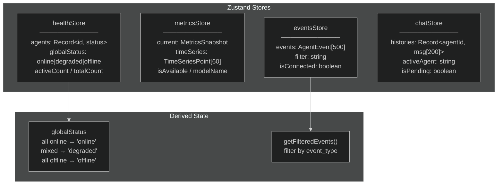

**Buffer invariants:**
- `metricsStore.timeSeries` — max 60 points (circular buffer, oldest discarded)
- `eventsStore.events` — max 500 events (newest first, oldest discarded)
- `chatStore.histories[agentId]` — max 200 messages per agent


### 4.4 Custom Hooks

| Hook | Interval | Purpose |
|------|----------|---------|
| `useHealthPolling` | 10s | Fetches `/.well-known/agent.json` (agents) and `/health` (MCP). Sets status to online/offline. |
| `useMetricsPolling` | 5s | Fetches `GET /metrics` from orchestrator. Computes derived time-series points. |
| `useWebSocket` | Auto-reconnect 5s | Connects to `ws://localhost:9990/ws/events`. Parses JSON events. |
| `useA2AChat` | On demand | Sends `POST /send_message` with 120s timeout. Returns response text. |

### 4.5 Dashboard Panels

#### Header
- Title: "IGNITE — Intelligent Service Orchestration"
- Shows: active agent count (e.g., "3/3 Agents"), global status badge, model name, "Live Telemetry" indicator

#### Topology Panel (React Flow)
- Directed graph: Orchestrator → Research Agent → MCP Server
- Nodes show name, port, and colored status indicator (green/red/grey)
- Edges labeled with protocol (A2A, MCP)

#### Metrics Panel (Recharts)
- **Gauges:** Total requests, total tokens, tool calls, active agents
- **Line charts:** Tokens/second, average latency, P50/P95/P99 latency
- Shows model name and "Metrics Unavailable" when endpoint is down

#### Chat Panel
- Tabbed interface: Orchestrator Agent | Research Agent
- User messages right-aligned (cyan), agent messages left-aligned (dark)
- Loading animation while awaiting response
- Error messages displayed in red
- Enter key to send, Shift+Enter for newline

#### Activity Log Panel
- Scrollable table with fixed height (no page expansion)
- Columns: Timestamp, Agent, Event Type, Details
- Filter dropdown: All Events, Request, Tool Call, Token Usage, Heartbeat, A2A Message, Error
- "Disconnected" badge when WebSocket is down

### 4.6 Styling

- **Background:** `#0a0a0f` (near-black)
- **Cards:** `#1a1a2e` with subtle borders
- **Accent colors:** Cyan `#00d4ff`, Green `#00ff88`, Red `#ff4444`, Amber `#ffaa00`
- **Font:** Monospace for data, sans-serif for labels
- **Responsive:** 2x2 grid on desktop (≥1024px), stacked on mobile

---

## 5. Communication Protocols

### 5.1 REST Endpoints (Dashboard ↔ Backend)

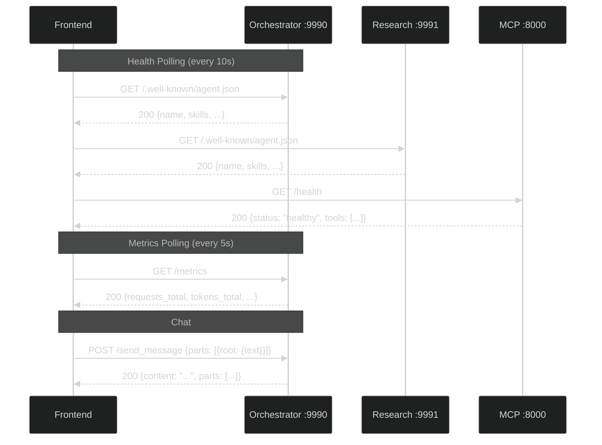

### 5.2 WebSocket Protocol

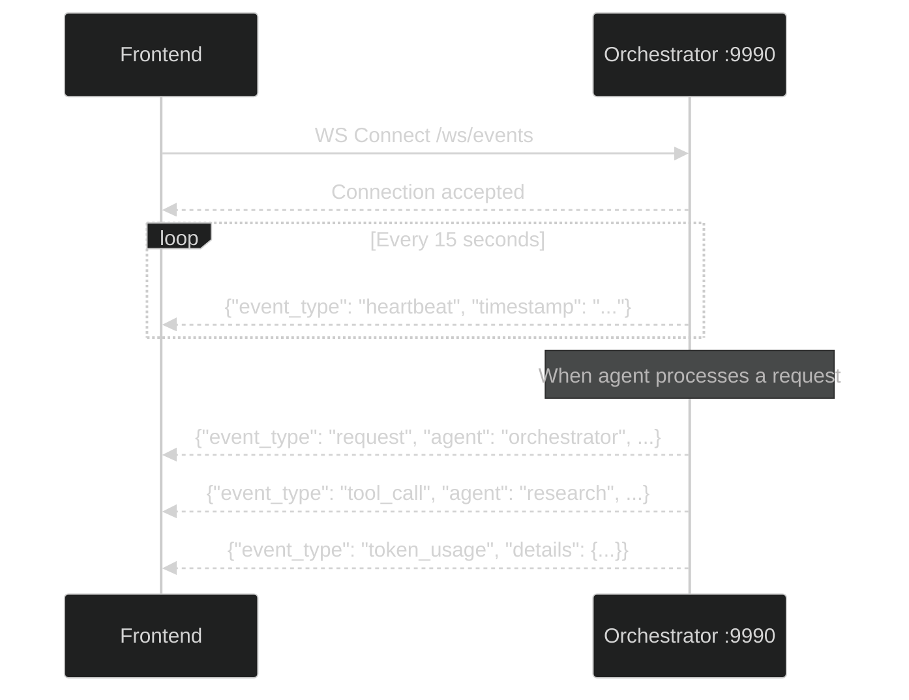

### 5.3 A2A Protocol (Agent ↔ Agent)

The A2A SDK uses JSON-RPC over HTTP. The orchestrator's `client.py` and the A2A executor use this for inter-agent communication. The dashboard bypasses this with direct REST calls to `/send_message`.

### 5.4 MCP Protocol (Agent ↔ Tools)

The MCP server uses streamable HTTP transport. The research agent connects via `MultiServerMCPClient` which:
1. Discovers available tools
2. Calls tools with parameters
3. Receives structured results


---

## 6. Data Flow Diagrams

### 6.1 Direct Answer (No Delegation)

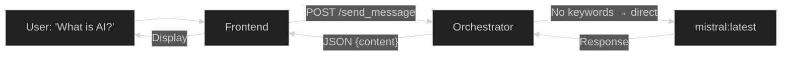

### 6.2 Delegated Research

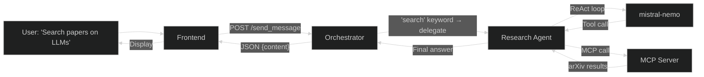

### 6.3 Real-Time Monitoring

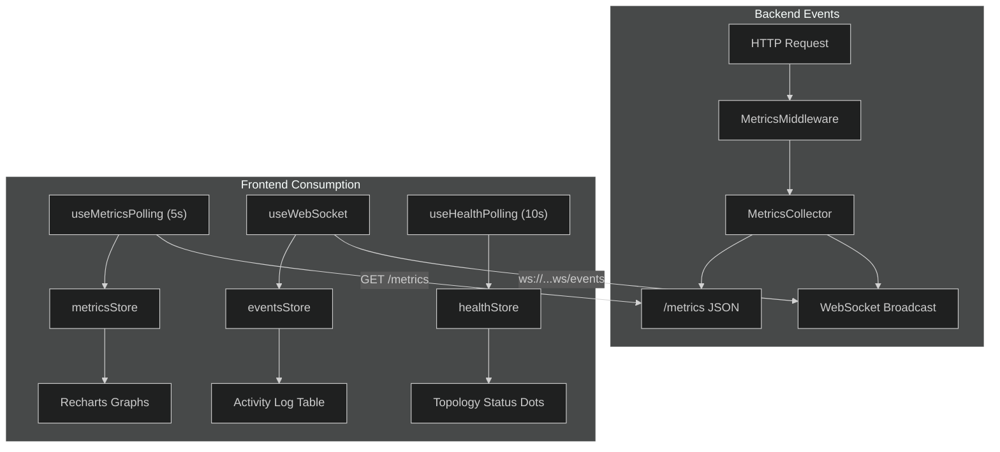

---

## 7. Running the System

### 7.1 Prerequisites

- Python 3.13+ with virtual environment
- Node.js 18+ (for frontend)
- Ollama server at `http://10.215.130.20:11434` with `mistral` and `mistral-nemo` models

### 7.2 Start Backend (3 terminals)

```cmd
# Terminal 1: MCP Server
.venv\Scripts\python.exe src\mcp_server.py

# Terminal 2: Research Agent
.venv\Scripts\python.exe src\a2a_1_starlette.py

# Terminal 3: Orchestrator
.venv\Scripts\python.exe src\orchestrator\o1_server.py
```

### 7.3 Start Frontend

```cmd
cd ignite-dashboard
"C:\Program Files\nodejs\node.exe" node_modules\next\dist\bin\next dev
```

### 7.4 Access

- **Dashboard:** http://localhost:3000
- **Orchestrator API:** http://localhost:9990
- **Research Agent API:** http://localhost:9991
- **MCP Health:** http://localhost:8000/health

---

## 8. File Reference

### 8.1 Backend Files

| File | Purpose | Port |
|------|---------|------|
| `src/mcp_server.py` | MCP tool server (DuckDuckGo, Wikipedia, arXiv) | 8000 |
| `src/a2a_1_starlette.py` | Research Agent HTTP server + /send_message | 9991 |
| `src/a2a_2_executor.py` | Research Agent task executor (streaming) | — |
| `src/a2a_3_agent.py` | Research Agent LangGraph ReAct core | — |
| `src/client.py` | CLI client for terminal interaction | — |
| `src/mcp_test_client.py` | Standalone MCP + LLM test client | — |
| `src/orchestrator/o1_server.py` | Orchestrator HTTP server + metrics + WebSocket | 9990 |
| `src/orchestrator/o2_executor.py` | Orchestrator task executor | — |
| `src/orchestrator/o3_agent.py` | Orchestrator LangGraph StateGraph | — |
| `src/orchestrator/metrics.py` | Singleton metrics collector | — |
| `src/orchestrator/metrics_middleware.py` | Starlette request timing middleware | — |

### 8.2 Frontend Files

| File | Purpose |
|------|---------|
| `src/app/page.tsx` | Main dashboard page (2x2 grid, hooks wiring) |
| `src/app/layout.tsx` | Root layout (dark theme, fonts) |
| `src/components/Header.tsx` | Global status bar |
| `src/components/TopologyPanel.tsx` | Agent graph visualization |
| `src/components/MetricsPanel.tsx` | Gauges and time-series charts |
| `src/components/ChatPanel.tsx` | Tabbed agent chat interface |
| `src/components/ActivityLogPanel.tsx` | Real-time event table |
| `src/hooks/useHealthPolling.ts` | Agent health check polling |
| `src/hooks/useMetricsPolling.ts` | Metrics endpoint polling |
| `src/hooks/useWebSocket.ts` | WebSocket with auto-reconnect |
| `src/hooks/useA2AChat.ts` | Chat message sending |
| `src/stores/healthStore.ts` | Agent status state |
| `src/stores/metricsStore.ts` | Metrics time-series state |
| `src/stores/eventsStore.ts` | WebSocket events state |
| `src/stores/chatStore.ts` | Chat message history state |
| `src/lib/types.ts` | Shared TypeScript interfaces |
| `src/lib/config.ts` | Environment variables + agent config |
| `src/lib/api.ts` | HTTP client with timeout |
| `src/lib/utils.ts` | Formatting helpers |

### 8.3 Configuration Files

| File | Purpose |
|------|---------|
| `pyproject.toml` | Python project metadata + dependencies |
| `requirements.txt` | Flat pip dependency list |
| `.python-version` | Python 3.13 |
| `ignite-dashboard/package.json` | Node.js dependencies |
| `ignite-dashboard/tailwind.config.ts` | Tailwind dark theme colors |
| `ignite-dashboard/tsconfig.json` | TypeScript configuration |
| `start_agents.bat` | Windows batch launcher |
| `start_agents.sh` | Linux/macOS tmux launcher |

---

*Generated for the `pw-agentic` branch — includes all local adaptations and the IGNITE frontend dashboard.*
