# A2A MCP LangGraph Agent Local

> A fully local, open-source agentic AI system combining **LangGraph** for agent development, **Ollama** for LLM serving, Model Context Protocol (**MCP**), and Agent-to-Agent (**A2A**) communication — no subscriptions, no cloud APIs, complete control.

## 🎯 What This Does

This project demonstrates a complete agentic AI stack running entirely on your machine:

- **🧭 LangGraph** orchestrates multi-agent workflows
- **🔌 MCP** provides standardized tool access
- **💬 A2A** enables agent-to-agent communication
- **⚙️ Ollama** serves local LLMs for reasoning

**Use cases:** Build research assistants, automated workflows, multi-agent systems, or experiment with agentic patterns — all without external API costs and full control.

**📖 Want to understand the architecture and concepts?** Read the [full blog post](https://your-blog-link.com)

---

## 🚀 Quick Start

### Prerequisites

- **Python 3.10+**
- **8GB+ RAM** (16GB recommended for larger models)
- **tmux** (for running multiple services)
- **macOS, Linux, or Windows with WSL**

Whilst, the code can entirely run in CPU, it is recommended some sort of GPU accelarator for better experience (reduce latency). This implementation has been tested with commercial-grade solutions; M1, M3, RTX. 
### Step 1: Install Dependencies

**Install tmux:**

macOS:
```bash
brew install tmux
```

Ubuntu/Debian:
```bash
sudo apt-get install tmux
```

**Install Ollama:**
```bash
curl -fsSL https://ollama.com/install.sh | sh
```

**Start Ollama and download model:**
```bash
ollama serve
ollama pull mistral-nemo # you can chose any open model available in Ollama. 
#if you change the model, make sure to update it accordingly in line 39 on src/a2a_3_agent.py
```

### Step 2: Clone and Setup

```bash
git clone https://github.com/JuanMaParraU/a2a-mcp-langgraph-agent-local.git
cd a2a-mcp-langgraph-agent-local
```

**Setup Python environment:**

Using `uv` (recommended):
```bash
uv sync
source .venv/bin/activate
```

Using standard venv:
```bash
python3 -m venv .venv
source .venv/bin/activate
pip install -r requirements.txt
```

### Step 3: Launch the System

```bash
chmod +x start_agents.sh
./start_agents.sh
```

This launches three services in separate tmux windows:
- **Window 0 (MCP):** MCP Server providing tools
- **Window 1 (Agent):** Agent Server with A2A + LangGraph
- **Window 2 (Client):** Interactive client for sending tasks

You should see something like this:


---

## 🎮 Managing the Tmux Session
If you are not familiar with tmux sessions, please visist [.......] for a quick introduction. 

### Switching Between Windows

```
Ctrl+b then 0  →  MCP Server
Ctrl+b then 1  →  Agent Server
Ctrl+b then 2  →  Client
```

Or cycle through:
```
Ctrl+b then n  →  Next window
Ctrl+b then p  →  Previous window
```

### Detach and Reattach

**Detach** (leave running in background):
```
Ctrl+b then d
```

**Reattach:**
```bash
tmux attach -t agentic-ai
```

### Stop the System
From any of the windows, press ```Ctrl + c``` and then

```bash
tmux kill-server
```
or 

```bash
tmux kill-session -t agentic-ai
```
---

## 🏗️ Architecture Overview

```mermaid
graph TB
    User[👤 User]
    Client[client.py<br/>A2A Client]
     subgraph A2A_Stack["🌐 A2A Agent Stack"]
        Starlette[a2a_1_starlette.py<br/>HTTP Server Starlette<br/>• REST API endpoints<br/>• A2A protocol]
        Executor[a2a_2_executor.py<br/>Task Execution Engine<br/>• Task lifecycle<br/>• Error handling]
        Agent[a2a_3_agent.py<br/>LangGraph Agent Core<br/>• Agent reasoning<br/>• Ollama LLM backend<br/>• MCP client]
    end
     subgraph MCP_Stack["🔌 MCP Tool Stack"]
        MCP[mcp_server.py<br/>MCP Protocol Layer<br/>• Standardizes tool access<br/>• Formats responses<br/>• Tool discovery]
         subgraph Tools["⚙️ Actual Tools"]
            DDG[🔍 DuckDuckGo<br/>Search]
            ArXiv[📚 arXiv<br/>Search]
            Wiki[📖 Wikipedia<br/>Search]
        end
    end
     Ollama[(🦙 Ollama<br/>Local LLM)]
     User -->|HTTP Request| Client
     Client -->|POST /send_message| Starlette
     Starlette -->|wraps| Executor
     Executor -->|wraps| Agent
     Agent -->|connects to| MCP
     Agent -.->|reasoning| Ollama
     MCP -->|wraps| Tools
     MCP -->|executes| DDG
     MCP -->|executes| ArXiv
     MCP -->|executes| Wiki
```



**Read more:** [Blog post with detailed architecture explanation](https://your-blog-link.com)

---

## 📁 Deep Dive

For detailed file descriptions, customization options, and examples, see the [src/ folder documentation](src/README.md).

---

## 🐛 Troubleshooting

### Ollama Connection Issues

**Error:** `ConnectionRefusedError: [Errno 61] Connection refused`

**Solution:** Make sure Ollama is running:
```bash
ollama serve
```

### Model Not Found

**Error:** `Model 'mistral-nemo' not found`

**Solution:**
```bash
ollama pull mistral-nemo
```

### Import Errors

**Solution:** Ensure virtual environment is activated (uv or venv):
```bash
source .venv/bin/activate
pip install -r requirements.txt
```

### tmux Session Already Exists

**Solution:**
```bash
tmux kill-session -t agentic-ai
./start_agents_tmux.sh
```

---

## 🤝 Contributing

Contributions welcome! Areas of interest:

- 🔭 **Observability tools** — visualize agent graphs and state
- 🧩 **Advanced A2A patterns** — negotiation, consensus protocols
- ⚙️ **New MCP tools** — database access, API integrations
- 🧠 **Model benchmarks** — performance comparisons
- 📚 **Documentation** — tutorials, examples, explanations

**How to contribute:**
1. Fork the repository
2. Create a feature branch
3. Make your changes
4. Submit a Pull Request

**Questions or ideas?** [Open an issue](https://github.com/JuanMaParraU/a2a-mcp-langgraph-agent-local/issues)

---

## 📖 Learn More

- **Blog Post:** [Building Fully Local Agentic AI](https://your-blog-link.com)
- **Source Code Details:** [src/ folder documentation](src/README.md)
- **LangGraph Docs:** [langchain-ai.github.io/langgraph](https://langchain-ai.github.io/langgraph/)
- **MCP Specification:** [Anthropic Model Context Protocol](https://www.anthropic.com/news/model-context-protocol)
- **A2A Specification:** [insert link]()
- **Ollama:** [ollama.ai](https://ollama.ai)

---
## TODO 
- Define the model remotly: Make the model a variable that can be updated. Allow the user define the model to talk to.
- Dynamic Agent Skills Retrieval and Definition: This task aims to enable agents to dynamically access and define their skills through MCP queries, allowing for greater flexibility and adaptability in handling various tasks. (Issue)
- Multi-agent Workflows: Implement a system that enables multiple agents to collaborate and execute complex tasks by defining and managing interactions between them. This will allow for the creation of more sophisticated AI solutions that leverage the unique capabilities of each agent. (Issue)
- Multi-step Workflows: Develop a mechanism for agents to execute multi-step workflows by breaking down complex tasks into smaller, manageable subtasks and orchestrating their execution in the appropriate sequence. This will improve the efficiency and effectiveness of AI systems in handling intricate problems. (Issue)
- Local Tooling Definitions: Create a repository of local tools that can be easily integrated into agent workflows, further expanding their capabilities without relying on external APIs or services. This will enhance the autonomy and control offered by our AI system. (Issue)

---

## 📄 License

MIT License - see [LICENSE](LICENSE) file for details

---

**Questions? Feedback?** Open an issue or reach out — I'd love to hear what you're building with this!

*Part of our exploration into accessible, open-source agentic AI infrastructure.*
