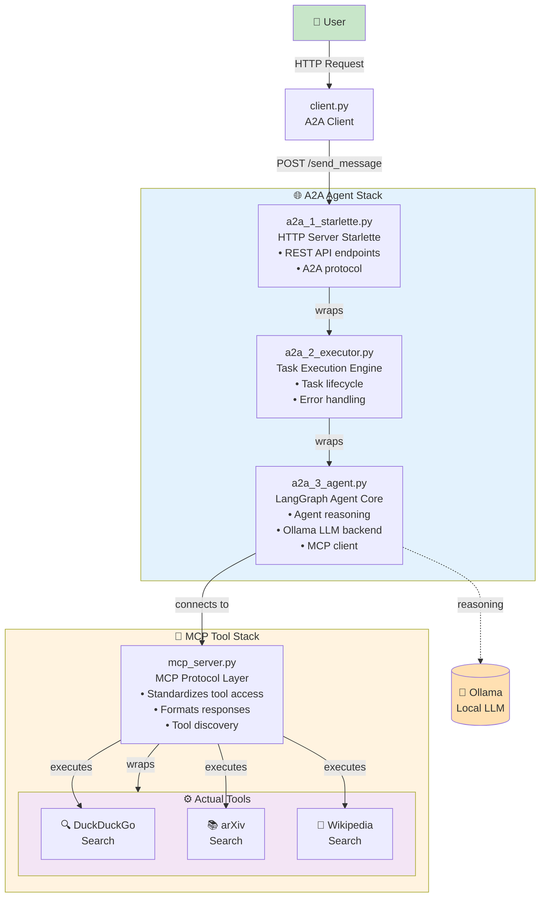

🧠 TL;DR
Conceptually:


* Agentic AI = reasoning LLMs autonomously executing multi-step processes

* A2A (Agent-to-Agent) = protocol enabling standardised communication with and between agents, and discovery of their capabilities

* MCP (Model Context Protocol) = standardised way for agents to access tools and APIs consistently

Implementation:

* Agentic SDKs use LLMs as reasoning engines

* A2A SDK wraps agent code, exposing its capabilities via a standard protocol

* MCP SDK wraps tools/APIs, exposing them via a standard protocol

In this tutorial, you’ll interact with an Agent via A2A, which accesses tools through MCP — all running locally with open-source software. If you want to skip the guide and go straight to the code 👉👉 🔗 GitHub Repository


💡 Introduction
We're at a pivotal moment in AI development. Whilst recent years focused on scaling models and refining APIs, the next frontier is autonomy—AI systems that can reason, plan, and execute complex tasks independently. <span style="color:red">Check</span> ***this needs to be improved, it should include MCP and A2A ***. 

When I started exploring agentic systems, there were excellent material here and there but suddenly I hit a wall: there was no complete, end-to-end implementation using only open-source tools. Everything required subscriptions, API keys, or vendor lock-in. I wanted pure, experimentation-ready practical solution that anyone could run locally and understand fully.

So I tried to built one.

This project combines the open-source **LangGraph** (agentic workflows), **MCP** (tool integration), and **A2A** (agent communication)—all running locally with models served through **Ollama**. It's designed for developers and researchers who want:

- Full control over their agentic workflows

- Privacy with no external LLM API calls

- Zero cost for unlimited experimentation  

- Transparency to understand exactly how everything works

Whether you're new to agentic AI or migrating from cloud-based solutions to local infrastructure, this provides a practical and hackable foundation that you can build upon.

🧠 Background & Key Concepts
🤖 Why Agentic AI Matters
Agentic AI marks an evolution from reactive to proactive, goal-oriented systems. Instead of prompt-response patterns, these systems:

- Plan their own actions

- Call tools or APIs when needed

- Collaborate with other agents
 
- Adapt dynamically to context
<span style="color:red">Check</span> 
This enables autonomous digital co-workers capable of reasoning and action — the foundation for next-generation intelligent automation. 
An Agentic System comprises of:
- Agentic framework
- LLMs
- Tools
- Environment 
REACT loop. Reasoning and Act, a common pattern from those with experience in autonomic computing loops, MAPE-K , ODDA, etc.

🧩 Model Context Protocol (MCP)
Developed by Anthropic, MCP defines a standard interface for models to connect with tools and data sources safely and consistently. Rather than framework-specific plugin systems, MCP provides a shared language for capability access, enabling true interoperability. <span style="color:red">Include MCP figure</span> 

📚 Learn more about MCP

🔁 Agent-to-Agent (A2A) Communication
When multiple agents coexist, they need structured communication. A2A provides this framework — defining how agents exchange messages, delegate tasks, and collaborate on shared objectives. 
<span style="color:red">Include A2A figure</span> 

📚 Learn more about A2A

Together, MCP and A2A create the foundation for cooperative, extensible agent ecosystems that grow organically rather than through rigid scripting.


## Local Implementation
🔗 Repository Structure
a2a-mcp-langgraph-agent-local demonstrates a local-first agentic architecture combining:

⚙️ Ollama — serves models locally without external APIs
🧭 LangGraph — orchestrates agents and state transitions
🔌 MCP — standardizes tool access
💬 A2A — handles inter-agent communication

Whilst, the code can entirely in CPU, it is recommended some sort of GPU accelarator for better experience (reduce latency). This implementation has been tested with commercial-grade solutions; M1, M3, RTX. 

### Building blocks:
#### **Ollama**

```python
from langchain_ollama import ChatOllama
model = ChatOllama(model="mistral-nemo", temperature=0)
```
In this implementation, we utilize Mistral-nemo as the Language Model (LLM), a solution that excels in handling tool usage and supporting multi-turn conversations using the RACT pattern. While Mistral-nemo is employed here, any model can be swapped out for experimentation purposes. To experiment with alternative models, simply run `Ollama pull {model-name}` to get started.
 Visit Ollama ***ollama link***<span style="color:red">Check</span>

#### **Langgraph Agent** 
Langraph is a framework developed by LangChain, known as one of the most popular open-source SDKs for building agents. It manages different stages of an agentic pipeline using graphs, where *nodes* represent individual components like input processing modules, LLM calls, and tool execution modules, and *edges* define their interactions. You can develop your own custom graphs to manage each stage of the agentic behavior or use LangGraph's pre-defined REACT template for streamlined development.

```python
    SYSTEM_INSTRUCTION = (
        """
        You are a smart research assistant agent. Use the search engine to look up information. \
        ...
        """
    )
     self.graph = create_react_agent(
        self.model,
        tools=self.tools, #For providing tools (avialable via MCP) to the agent
        checkpointer=memory, #For providing memory, imporant for multi-turn conversations and long lasting tasks 
        debug=True,
        prompt=self.SYSTEM_INSTRUCTION, #Initial prompt to define the scope of the agen 
        response_format=ResponseFormat, #Pass a template for managing the Agent interactions with users, agents, and tools
        )
```

<span style="color:red">Check</span>

#### **MCP Stack**
the stack is comprised by the server, the tools that are defined in the server, and the client that communicate with the server. <span style="color:red">Check</span>

##### Server
```py
from mcp.server.fastmcp import FastMCP
# Initialize FastMCP server with a service name
mcp = FastMCP("ResearchTools")
# Wikipedia search tool -- running async with a loop executor
@mcp.tool()
async def wikipedia_search(query: str) -> str:
    """Search Wikipedia for factual information."""
    try:
        loop = asyncio.get_event_loop()
        result = await loop.run_in_executor(None, partial(wikipedia.summary, query, sentences=3))
        return result
        ...
...
# Run MCP server 
 mcp.run(transport="streamable-http")
```
##### Client 
```py
from langchain_mcp_adapters.client import MultiServerMCPClient
    async def _get_mcp_tools(self):
        """Get tools from MCP server."""
        mcp_client = MultiServerMCPClient(
            {
                "research": {
                    "url": "http://localhost:8000/mcp/",
                    "transport": "streamable_http",
                }
            }
        )
        tools = await mcp_client.get_tools()
        return tools
```

#### **A2A stack**
**Startlette**
```python
    agent_card = AgentCard(
        name="LangGraph Agent",
        description="A simple LangGraph agent that does web searchs",
        url="http://localhost:9998/",
        skills=skills,
        ...
    )
    request_handler = DefaultRequestHandler(
        agent_executor=LangGraphAgentExecutor(),
        task_store=InMemoryTaskStore(),
    )
    server = A2AStarletteApplication(
        http_handler=request_handler,
        agent_card=agent_card,
    )
```
**Executor**
```py
    async def execute(self, context: RequestContext, event_queue: EventQueue) -> None:
        ### managing inputs

    async def cancel(self, context: RequestContext, event_queue: EventQueue) -> None:
        raise ServerError(error=UnsupportedOperationError())
```
**Agent**
Use langGraph base template and extend it with
```python

async def invoke(self, query, context_id):
        """Async invoke method."""
        ...
async def stream(self, query, context_id) -> AsyncIterable[dict[str, Any]]:
        """Token-by-token streaming using astream_events."""
        ...
    def get_agent_response(self, config):
        current_state = self.graph.get_state(config)
        structured_response = current_state.values.get("structured_response")
        ...
```

**Wrapping structure:**
```
a2a_1_starlette.py (HTTP server)
    └─ wraps a2a_2_executor.py (Task execution)
        └─ wraps a2a_3_agent.py (LangGraph + Ollama)
            └─ connects to mcp_server.py (Tools)
```
# 🏗️ Putting things together; Architecture Overview

This gives you hands-on experience with agentic systems from an implementation perspective — understanding not just what these concepts mean, but how they actually work together in code.




## 🧪 Possible Enhancements
This is a foundation, not a finished product. Here are directions I'm considering — and I'd love your input:

🔭 Graph Visualization — add observability tools for agent state and transitions

🧩 Advanced A2A Patterns — implement negotiation, consensus, and error recovery protocols

⚙️ Extended MCP Tools — integrate databases, REST APIs, and custom data sources

🧠 Model Experimentation — benchmark different local models for specific agent tasks

🤝 Plugin System — create an extension framework for community-built agents and tools

What would you build with this? What tools should we prioritize next?


🧭 Conclusion
I built this project to share my understanding of agentic systems from a practical, implementation-focused perspective. If you're starting with agentic AI or trying to move to fully local, controlled workflows, I hope this provides a useful foundation.

More importantly, this is an invitation to collaborate. Agentic AI is evolving rapidly, and the best innovations will come from shared knowledge and open experimentation.

💬 I'm eager to hear from you:
What use cases are you exploring with agentic AI?

How are you approaching local agentic systems?

What challenges are you facing that this could help solve?

What features or tools would make this more valuable?

Get involved:

🔗 Clone the repo and experiment: a2a-mcp-langgraph-agent-local

💡 Open an issue with ideas or questions

🤝 Submit a PR if you build something interesting

📧 Reach out directly — I'd love to hear what you're working on

At BT Group , We're actively exploring how autonomous agents can transform intelligent automation. This project represents our commitment to building in the open and making cutting-edge AI infrastructure accessible to everyone.

Let's build the future of agentic AI together.


Shared with the community — exploring the frontier of intelligent automation, one open-source project at a time.

#AI #AgenticAI #LangGraph #MCP #A2A #OpenSource #Automation #Anthropic #AIEngineering #LocalAI