# Building Local Agentic AI: A2A, MCP & LangGraph Integration

## 🧠 TL;DR

**Conceptually:**
- **Agentic AI** = Reasoning LLMs autonomously executing multi-step processes
- **A2A (Agent-to-Agent)** = Protocol enabling standardized communication with and between agents, and discovery of their capabilities
- **MCP (Model Context Protocol)** = Standardized way for agents to access tools and APIs consistently

**Implementation:**
- Agentic SDKs use LLMs as reasoning engines
- A2A SDK wraps agent code, exposing its capabilities via a standard protocol
- MCP SDK wraps tools/APIs, exposing them via a standard protocol

In this tutorial, you'll interact with an Agent via A2A, which accesses tools through MCP — all running locally with open-source software.

**🔗 [GitHub Repository](https://github.com/JuanMaParraU/a2a-mcp-langgraph-agent-local/tree/main)**

---

## 💡 Introduction

### 2025: The Year of Agents

We're at a key moment in AI development. While recent years focused on scaling models and refining APIs, the next frontier is **autonomy**—AI systems that can reason, plan, and execute complex tasks independently. 

The convergence of three key technologies is making this possible:
- **MCP** enables agents to reliably access tools and data sources
- **A2A** provides the communication layer for multi-agent collaboration
- **Agentic frameworks** orchestrate the reasoning and execution loops

When I started exploring agentic systems for my research work at [BT Group](https://www.bt.com/about/bt/research-and-development), I found excellent materials scattered across various sources, but I hit a wall: there was no complete, end-to-end implementation using only open-source tools. Everything required subscriptions, API keys, or vendor lock-in. I wanted a pure, experimentation-ready practical solution that anyone could run locally and understand fully.

So I built one.

This project combines the open-source **LangGraph** (agentic workflows), **MCP** (tool integration), and **A2A** (agent communication)—all running locally with models served through **Ollama**. It's designed for developers and researchers who want:

- ✅ Full control over their agentic workflows
- 🔒 Privacy with no external LLM API calls
- 💰 Zero cost for unlimited experimentation
- 🔍 Transparency to understand exactly how everything works

Whether you're new to agentic AI or migrating from cloud-based solutions to local infrastructure, this provides a practical and hackable foundation that you can build upon.

---

## 🧠 Background & Key Concepts

### 🤖 Why Agentic AI Matters

Agentic AI marks an evolution from reactive to proactive, goal-oriented systems. Instead of simple prompt-response patterns, these systems:

- 🎯 **Plan their own actions** using multi-step reasoning
- 🔧 **Call tools or APIs** when needed to accomplish goals
- 🤝 **Collaborate with other agents** to solve complex problems
- 🔄 **Adapt dynamically** to changing context and feedback

This enables autonomous digital co-workers capable of reasoning and action — the foundation for next-generation intelligent automation.

#### Components of an Agentic System

An agentic system comprises four key elements:

1. **Agentic Framework** - Orchestrates the reasoning loop (LangGraph, AutoGen, CrewAI)
2. **LLMs** - Provide reasoning and decision-making capabilities
3. **Tools** - Enable interaction with external systems and data
4. **Environment** - Context and state management for task execution

#### The ReAct Loop

Most agentic systems follow the **ReAct** (Reasoning and Acting) pattern, familiar to those with experience in autonomic computing loops like MAPE-K (Monitor, Analyze, Plan, Execute, Knowledge) and OODA (Observe, Orient, Decide, Act):

```
1. Reason about the current state and goal
2. Decide on an action (use a tool, respond, etc.)
3. Execute the action
4. Observe the results
5. Repeat until goal is achieved
```

---

### 🧩 Model Context Protocol (MCP)

Developed by Anthropic, MCP defines a standard interface for models to connect with tools and data sources safely and consistently. Rather than framework-specific plugin systems, MCP provides a shared language for capability access, enabling true interoperability.

**Key Benefits:**
- 🔌 **Universal Tool Interface** - One protocol works across all frameworks
- 🔐 **Security Built-in** - Standardized permission and authentication models
- 📦 **Plug-and-Play** - Add new tools without modifying agent code
- 🌐 **Ecosystem Growth** - Shared tool marketplace across platforms


📚 **Learn more:** [MCP Documentation](https://modelcontextprotocol.io/)

---

### 🔁 Agent-to-Agent (A2A) Communication

When multiple agents coexist, they need structured communication. A2A provides this framework — defining how agents exchange messages, delegate tasks, and collaborate on shared objectives. Originally developed by Google, A2A has now been donated to the Linux Foundation.

Beyond inter-agent coordination, A2A also establishes a **standardized interface** for communicating with agents regardless of their backend implementation. This means you can interact with a LangGraph agent, an AutoGen agent, or a custom-built agent using the same protocol, enabling true framework-agnostic agent ecosystems.

**Key Capabilities:**
- 📋 **Task Delegation** - Agents can assign work to specialized agents
- 💬 **Message Exchange** - Structured communication protocols
- 🔍 **Capability Discovery** - Agents can query what other agents can do
- 🤝 **Coordination** - Multi-agent workflows with shared state


📚 **Learn more:** [A2A Protocol Specification](https://a2a-protocol.org/latest/)

Together, **MCP and A2A** create the foundation for cooperative, extensible agent ecosystems that grow organically rather than through rigid scripting.

---

## 🏗️ Local Implementation

### 🔗 Repository Structure

The `a2a-mcp-langgraph-agent-local` repository demonstrates a local-first agentic architecture combining:

- ⚙️ **Ollama** — Serves models locally without external APIs
- 🧭 **LangGraph** — Orchestrates agents and state transitions
- 🔌 **MCP** — Standardizes tool access
- 💬 **A2A** — Handles inter-agent communication

**Performance Note:** While the code can run entirely on CPU, a GPU accelerator is recommended for better experience (reduced latency). This implementation has been tested with commercial-grade solutions: M1, M3, and RTX GPUs.

---

### 🧱 Building Blocks

#### **1. Ollama - Local Model Serving**
In this implementation, we use **Ollama** for local LLM serving due to its simplicity and broad model support. Other powerful alternatives include **vLLM** (high-performance serving with PagedAttention—we're exploring this in our next iteration), **SGLang** (optimized for structured generation), **Triton Inference Server** (production-grade NVIDIA solution), and **llama.cpp** (lightweight C++ implementation).

```python
from langchain_ollama import ChatOllama

model = ChatOllama(
    model="mistral-nemo", 
    temperature=0
)
```

In this implementation, we utilize **Mistral-Nemo** as the Language Model (LLM), a solution that excels in:
- Tool usage and function calling
- Multi-turn conversations using the ReAct pattern
- Instruction following and reasoning

While Mistral-Nemo is employed here, any model can be swapped out for experimentation. To experiment with alternative models, simply run:

```bash
ollama pull {model-name}
```

**Popular alternatives to try:**
- `llama3.1` - Strong general reasoning
- `qwen2.5` - Excellent tool use
- `deepseek-r1` - Advanced reasoning capabilities

🔗 **Visit:** [Ollama Official Site](https://ollama.ai/)

---

#### **2. LangGraph Agent - Orchestration Framework**

LangGraph is a framework developed by LangChain, one of the most popular open-source SDKs for building agents. It manages different stages of an agentic pipeline using **graphs**, where:
- **Nodes** represent individual components (input processing, LLM calls, tool execution)
- **Edges** define interactions and control flow between nodes

You can develop custom graphs to manage each stage of agentic behavior or use LangGraph's pre-defined **ReAct template** for streamlined development.

```python
SYSTEM_INSTRUCTION = """
You are a smart research assistant agent. Use the search engine to look up information.
You have access to the following tools:
- wikipedia_search: For factual encyclopedia information
- arxiv_search: For academic papers and research
- duckduckgo_search: For general web search

Always cite your sources and provide comprehensive answers.
"""

self.graph = create_react_agent(
    self.model,
    tools=self.tools,              # Tools available via MCP
    checkpointer=memory,            # Memory for multi-turn conversations
    debug=True,
    prompt=self.SYSTEM_INSTRUCTION, # Initial prompt defining agent scope
    response_format=ResponseFormat, # Template for managing interactions
)
```

**Key Features:**
- 🔄 **State Management** - Track conversation and task state
- 💾 **Checkpointing** - Persist state for long-running tasks
- 🛠️ **Tool Integration** - Seamless MCP tool binding
- 🎯 **Response Formatting** - Structured output for A2A protocol

---

#### **3. MCP Stack - Tool Integration Layer**

The MCP stack comprises three components:
1. **Server** - Hosts and exposes tools via MCP protocol
2. **Tools** - Actual functionality (search, database, APIs)
3. **Client** - Consumes tools from MCP servers

##### MCP Server

```python
from mcp.server.fastmcp import FastMCP
from functools import partial
import asyncio
import wikipedia

# Initialize FastMCP server with a service name
mcp = FastMCP("ResearchTools")

# Wikipedia search tool - running async with a loop executor
@mcp.tool()
async def wikipedia_search(query: str) -> str:
    """Search Wikipedia for factual information.
    
    Args:
        query: The search term or topic to look up
        
    Returns:
        A summary of the Wikipedia article (3 sentences)
    """
    try:
        loop = asyncio.get_event_loop()
        result = await loop.run_in_executor(
            None, 
            partial(wikipedia.summary, query, sentences=3)
        )
        return result
        ...

@mcp.tool()
async def arxiv_search(query: str) -> str:
    """Search arXiv for academic papers."""
    # Implementation here
    pass
    ...x

# Run MCP server on HTTP transport
mcp.run(transport="streamable-http")
```

##### MCP Client

```python
from langchain_mcp_adapters.client import MultiServerMCPClient

async def _get_mcp_tools(self):
    """Get tools from MCP server."""
    mcp_client = MultiServerMCPClient(
        {
            "research": {
                "url": "http://localhost:8000/mcp/",
                "transport": "streamable_http",
            }
        }
    )
    
    # Retrieve all available tools from the MCP server
    tools = await mcp_client.get_tools()
    return tools
```

**Benefits of MCP Architecture:**
- 🔧 **Separation of Concerns** - Tools independent of agent logic
- 🔄 **Hot Swapping** - Update tools without restarting agents
- 📊 **Centralized Management** - One server, multiple agents
- 🧪 **Easy Testing** - Test tools independently

---

#### **4. A2A Stack - Agent Communication Layer**

The A2A stack wraps your agent to make it discoverable and communicable via the A2A protocol. It comprises three components:
1. **HTTP Server** - Exposes agent via A2A protocol endpoints and handles agent discovery
2. **Executor** - Manages task lifecycle, event streaming, and error handling
3. **Agent Wrapper** - Adapts your agent implementation to A2A interface standards


##### Starlette HTTP Server

```python
from a2a import AgentCard, DefaultRequestHandler, A2AStarletteApplication
from a2a.memory import InMemoryTaskStore

# Define agent capabilities and metadata
agent_card = AgentCard(
    name="LangGraph Research Agent",
    description="A research agent with web search, Wikipedia, and arXiv access",
    url="http://localhost:9998/",
    skills=[
        "web_search",
        "academic_research", 
        "fact_checking",
        "information_synthesis"
    ],
    version="1.0.0",
)

# Create request handler with your agent executor
request_handler = DefaultRequestHandler(
    agent_executor=LangGraphAgentExecutor(),
    task_store=InMemoryTaskStore(),
)

# Wrap in A2A-compliant HTTP server
server = A2AStarletteApplication(
    http_handler=request_handler,
    agent_card=agent_card,
)
```

##### Agent Executor

```python
class LangGraphAgentExecutor:
    """Executes agent tasks with proper lifecycle management."""
    
    async def execute(
        self, 
        context: RequestContext, 
        event_queue: EventQueue
    ) -> None:
        """
        Main execution method called by A2A framework.
        
        Args:
            context: Request context with user input and session info
            event_queue: Queue for sending events back to caller
        """
        # Extract user message
        user_message = context.message
        session_id = context.session_id
        
        # Execute agent with streaming
        async for event in self.agent.stream(user_message, session_id):
            await event_queue.put(event)
        
        # Send final response
        response = self.agent.get_agent_response(session_id)
        await event_queue.put(response)
    
    async def cancel(
        self, 
        context: RequestContext, 
        event_queue: EventQueue
    ) -> None:
        """Handle task cancellation."""
        raise ServerError(error=UnsupportedOperationError())
```

##### LangGraph Agent Wrapper

```python
class LangGraphAgent:
    """Wraps LangGraph with A2A-compatible interface."""
    
    async def invoke(self, query: str, context_id: str):
        """Async invoke method for single-shot queries."""
        config = {"configurable": {"thread_id": context_id}}
        result = await self.graph.ainvoke(
            {"messages": [("user", query)]},
            config=config
        )
        return result
    
    async def stream(
        self, 
        query: str, 
        context_id: str
    ) -> AsyncIterable[dict[str, Any]]:
        """Token-by-token streaming using astream_events."""
        config = {"configurable": {"thread_id": context_id}}
        
        async for event in self.graph.astream_events(
            {"messages": [("user", query)]},
            config=config,
            version="v2"
        ):
            # Filter and format events for A2A protocol
            if event["event"] == "on_chat_model_stream":
                chunk = event["data"]["chunk"]
                if hasattr(chunk, "content"):
                    yield {
                        "type": "content_delta",
                        "delta": chunk.content
                    }
    
    def get_agent_response(self, context_id: str):
        """Retrieve final structured response."""
        config = {"configurable": {"thread_id": context_id}}
        current_state = self.graph.get_state(config)
        structured_response = current_state.values.get("structured_response")
        return structured_response
```

##### Wrapping Architecture

The layered architecture provides clean separation:

```
a2a_1_starlette.py          # HTTP server + A2A protocol
    └─ wraps
a2a_2_executor.py           # Task lifecycle management
    └─ wraps
a2a_3_agent.py              # LangGraph + Ollama reasoning
    └─ connects to
mcp_server.py               # Tool access via MCP
```

**Benefits:**
- 🏗️ **Modularity** - Each layer has clear responsibilities
- 🔄 **Reusability** - Swap components without breaking others
- 🧪 **Testability** - Test each layer independently
- 📈 **Scalability** - Scale components independently

---

## 🎯 Architecture Overview

This architecture gives you hands-on experience with agentic systems from an implementation perspective — understanding not just what these concepts mean, but how they actually work together in code.

```mermaid
graph TB
    User[👤 User]
    Client[client.py<br/>A2A Client]
    
    subgraph A2A_Stack["🌐 A2A Agent Stack"]
        Starlette[a2a_1_starlette.py<br/>HTTP Server Starlette<br/>• REST API endpoints<br/>• A2A protocol<br/>• Agent discovery]
        Executor[a2a_2_executor.py<br/>Task Execution Engine<br/>• Task lifecycle<br/>• Event streaming<br/>• Error handling]
        Agent[a2a_3_agent.py<br/>LangGraph Agent Core<br/>• ReAct reasoning loop<br/>• Ollama LLM backend<br/>• MCP client connection<br/>• State management]
    end
    
    subgraph MCP_Stack["🔌 MCP Tool Stack"]
        MCP[mcp_server.py<br/>MCP Protocol Layer<br/>• Standardizes tool access<br/>• Formats responses<br/>• Tool discovery API<br/>• Error handling]
        
        subgraph Tools["⚙️ Actual Tools"]
            DDG[🔍 DuckDuckGo<br/>Web Search]
            ArXiv[📚 arXiv<br/>Academic Papers]
            Wiki[📖 Wikipedia<br/>Encyclopedia]
        end
    end
    
    Ollama[(🦙 Ollama<br/>Local LLM<br/>Mistral-Nemo)]
    
    User -->|HTTP Request| Client
    Client -->|POST /send_message| Starlette
    Starlette -->|wraps| Executor
    Executor -->|wraps| Agent
    Agent -->|MCP Protocol| MCP
    Agent -.->|reasoning queries| Ollama
    MCP -->|exposes| Tools
    MCP -->|executes| DDG
    MCP -->|executes| ArXiv
    MCP -->|executes| Wiki
    
    style A2A_Stack fill:#e3f2fd
    style MCP_Stack fill:#fff3e0
    style Tools fill:#f3e5f5
    style User fill:#c8e6c9
    style Ollama fill:#ffe0b2
```



---

## 🚀 Quick Getting Started

### Prerequisites

- Python 3.10+
- Ollama installed and running
- Tmux installed
- 8GB+ RAM (16GB+ recommended)
- GPU recommended but not required

### Installation

```bash
# Clone the repository
git clone https://github.com/JuanMaParraU/a2a-mcp-langgraph-agent-local/tree/main
cd a2a-mcp-langgraph-agent-local

# Create virtual environment
python -m venv venv
source venv/bin/activate  # On Windows: venv\Scripts\activate

# Install dependencies
pip install -r requirements.txt

# Pull Ollama model
ollama pull mistral-nemo
```

### Running the System

```bash
chmod +x start_agents.sh
./start_agents.sh
```

---

## 🧪 Possible Enhancements

This is a foundation, not a finished product. Here are directions for future development:

### 🚀 Distributed Inference Support
- **Ray and vLLM Integration** - Scale inference across multiple GPUs or machines using Ray's distributed computing framework combined with vLLM's high-performance serving. This enables:
  - **Horizontal Scaling** - Distribute model inference across a cluster for higher throughput
  - **PagedAttention** - vLLM's efficient memory management for handling long contexts and batch processing
  - **Model Parallelism** - Split large models across multiple GPUs for serving models that don't fit on a single device
  - **Dynamic Batching** - Automatically batch requests for improved GPU utilization
  - **Multi-Model Serving** - Host multiple specialized models (e.g., reasoning, code generation, summarization) with intelligent routing


### 🔭 Observability & Debugging
- **Graph Visualization** - Add visual debugging tools for agent state and transitions
- **Tracing** - Implement distributed tracing for multi-agent workflows
- **Metrics** - Add performance monitoring and bottleneck identification
- **Logging** - Structured logging for all agent decisions and tool calls

### 🧩 Advanced A2A Patterns
- **Negotiation Protocols** - Implement agent-to-agent negotiation for resource allocation
- **Consensus Mechanisms** - Multi-agent voting and decision-making
- **Error Recovery** - Automatic retry and fallback strategies
- **Load Balancing** - Distribute tasks across multiple agent instances

### ⚙️ Extended MCP Tools
- **Database Integration** - SQL, MongoDB, Redis connectors
- **REST APIs** - Generic REST client with authentication
- **Custom Data Sources** - File systems, cloud storage, webhooks
- **Authentication** - OAuth, API key management, secure credential storage

### 🧠 Model Experimentation
- **Benchmark Suite** - Compare different local models for specific agent tasks
- **Model Router** - Automatically select best model for each task type
- **Fine-tuning** - Custom model training for domain-specific agents
- **Quantization** - Optimize models for resource-constrained environments

### 🤝 Plugin System
- **Extension Framework** - Create an plugin architecture for community contributions
- **Tool Marketplace** - Share and discover MCP tools
- **Agent Templates** - Pre-built agent patterns for common use cases
- **Configuration Management** - Easy setup and deployment of complex workflows

### 💡 Your Ideas?

What would you build with this? What tools should we prioritize next? Open an issue or PR with your suggestions!

---

## 🧭 Conclusion

I built this project to share my understanding of agentic systems from a practical, implementation-focused perspective. If you're starting with agentic AI or trying to move to fully local, controlled workflows, I hope this provides a useful foundation.

More importantly, this is an **invitation to collaborate**. Agentic AI is evolving rapidly, and the best innovations will come from shared knowledge and open experimentation.

### 💬 I'm Eager to Hear From You

- What use cases are you exploring with agentic AI?
- How are you approaching local agentic systems?
- What challenges are you facing that this could help solve?
- What features or tools would make this more valuable?

### Get Involved

- 🔗 **Clone the repo** and experiment: [a2a-mcp-langgraph-agent-local](https://github.com/JuanMaParraU/a2a-mcp-langgraph-agent-local/tree/main)
- 💡 **Open an issue** with ideas or questions
- 🤝 **Submit a PR** if you build something interesting
- 📧 **Reach out directly** — I'd love to hear what you're working on

At **BT Group**, we're actively exploring how autonomous agents can transform intelligent automation. This project represents our commitment to building in the open and making cutting-edge AI infrastructure accessible to everyone.

**Let's build the future of agentic AI together.**

---

*Shared with the community — exploring the frontier of intelligent automation, one open-source project at a time.*

---

## 📚 Additional Resources

- [LangGraph Documentation](https://langchain-ai.github.io/langgraph/)
- [Model Context Protocol (MCP)](https://modelcontextprotocol.io/)
- [Agent-to-Agent Protocol (A2A)](https://developers.googleblog.com/en/a2a-a-new-era-of-agent-interoperability/)
- [Ollama Models](https://ollama.ai/library)
- [Anthropic Documentation](https://docs.anthropic.com/)

---

## 📄 License

[Add your license here]

---

## 🙏 Acknowledgments

Built with ❤️ using:
- [LangChain](https://github.com/langchain-ai/langchain) & [LangGraph](https://github.com/langchain-ai/langgraph)
- [Anthropic's MCP](https://modelcontextprotocol.io/)
- [Google's A2A](https://a2a.anthropic.com/)
- [Ollama](https://ollama.ai/)

---

**Tags:** `#AI` `#AgenticAI` `#LangGraph` `#MCP` `#A2A` `#OpenSource` `#Automation` `#Anthropic` `#AIEngineering` `#LocalAI`